

  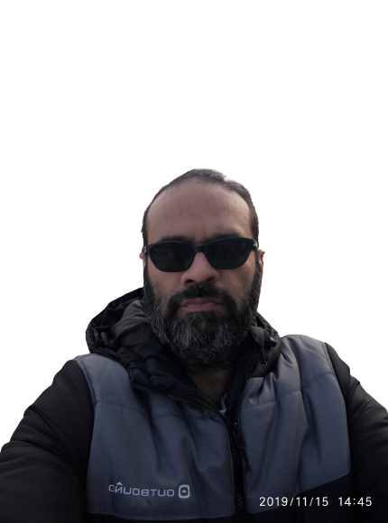

<h1 align="center">Shahzad MS</h1>

<strong>34 years connecting business needs with working technology · 1992–2026</strong>

Principal Enterprise Cloud &amp; AI Architect · Hands-on Technical Leader · Forward-Deployed Engineer · Fractional CTO/CIO

  <a href="https://shahzadms7.github.io/"><strong>🌐 Explore my portfolio</strong></a> &nbsp;|&nbsp;
  <a href="mailto:shahzad.ms@yahoo.com"><strong>✉️ Discuss an opportunity</strong></a> &nbsp;|&nbsp;
  <a href="https://www.linkedin.com/in/shahzadms/"><strong>LinkedIn</strong></a>

<strong>Greater Toronto Area, Canada · Available immediately</strong> 
Employment · Contracts · Consulting · Fractional leadership · Project delivery · Selected startup partnerships 
Remote, hybrid and onsite opportunities; cross-border engagements subject to eligibility.

---

## 🧭 The work behind the titles

I help organizations decide what to build, modernize what they depend on, secure what matters and operate what they deliver.

My career began with systems and software foundations in 1992 and grew through ISP operations, datacentres, enterprise platforms, cloud transformation, cybersecurity, software products, data and AI. I work across the whole engagement: listening to business stakeholders, defining scope, making architecture decisions, implementing systems, leading delivery, resolving difficult incidents and handing over supportable services.

That combination is my value: **executive conversations, architecture ownership and hands-on engineering connected to the same business outcome.**

[My journey](#-my-journey--19922026) · [Business outcomes](#-where-i-can-help) · [Architecture](#-see-how-i-think-and-deliver) · [Technology breadth](#-my-technology-and-delivery-breadth) · [Project experience](#-41-project-families--one-career) · [Learning](#-education-credentials-and-continuous-learning) · [Work with me](#-lets-work-together)

## 🕰️ My journey · 1992–2026

| Career chapter | How my responsibilities developed |
|---|---|
| **1992–2000 · Technical foundations** | Early systems, software, networking and enterprise technology work; customer support and practical problem-solving across international environments. |
| **2000–2019 · ISP and datacentre operations** | Physical infrastructure, carrier networking, hosting, virtualization, storage, identity, email, security, availability and recovery; architecture and complex operational escalation. |
| **2020 · Professional-services modernization** | Microsoft identity, messaging and collaboration migration; permission reconciliation, continuity, user adoption and service transition. |
| **2021–2025 · Managed multi-cloud delivery** | MSP/CSP/MSSP environments: landing zones, cloud and systems engineering, DevSecOps, platform engineering, SRE, security, migrations and customer advisory. |
| **2023–present · Founder-led product engineering** | Open-source, tenant-aware SaaS: business discovery, architecture, application/API development, identity, data, delivery automation and product evolution. |
| **2025–2026 · Enterprise cloud, data and AI** | Microsoft/Azure transformation for a distributed business; governed data, security, AI workflows, operational readiness and production-pilot delivery. |
| **2026 · Fractional technology leadership** | AWS-based cloud and AI delivery, product architecture, engineering direction, commercial decisions and executive advisory. |

*Some engagements overlap. Client and employer environments are generalized here to respect confidentiality; a complete permitted career walkthrough is available in conversation.*

## 🎯 Where I can help

| If your organization needs to… | I can take responsibility for… |
|---|---|
| **Choose the right direction** | Discovery, stakeholder workshops, current-state assessment, business case, architecture options, roadmap, budget and vendor decisions. |
| **Modernize without losing continuity** | Datacentre and cloud migration, identity and messaging transition, application dependencies, cutover, rollback and recovery planning. |
| **Launch or scale a product** | Prototype, MVP, pilot and production readiness; tenant-aware SaaS, platform services, APIs, integration and operational ownership. |
| **Strengthen security and resilience** | Zero Trust, IAM/PIM/PAM, endpoint and cloud protection, SOC integration, risk controls, backup, disaster recovery and business continuity. |
| **Turn data and AI into useful services** | Data engineering, analytics, governed retrieval, AI agents, evaluation, controlled tools, adoption and lifecycle operations. |
| **Improve engineering delivery** | Infrastructure as code, CI/CD, GitOps, platform engineering, SRE, observability, performance, incident response and FinOps. |
| **Extend leadership or delivery capacity** | Fractional CTO/CIO, architecture leadership, presales, proposals/SOWs, partner enablement, mentoring, complex escalation and handover. |

**Business models:** B2B · B2C · B2B2C · IaaS · PaaS · SaaS · MSP · CSP · MSSP · ISP 
**Delivery settings:** Enterprise · Startup · Service provider · Distributed operations · Public, private and hybrid cloud

## 🏗️ See how I think and deliver

I connect the business decision to the operating service. Scope, ownership, acceptance criteria and recovery are part of delivery—not afterthoughts.

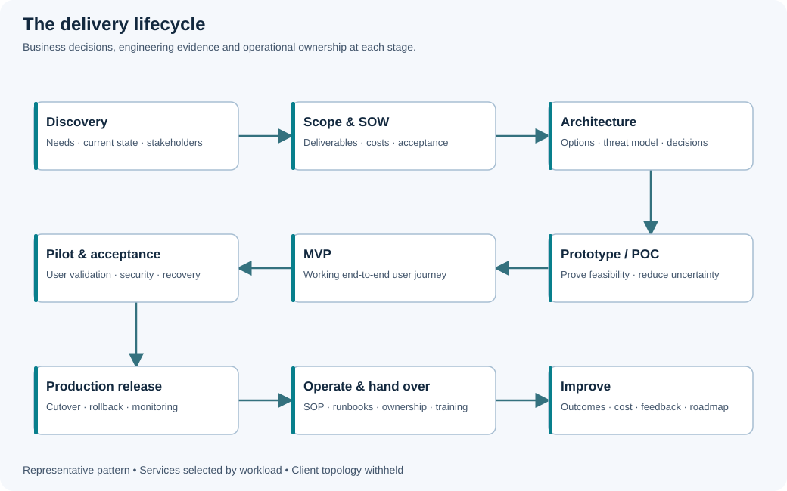

**What clients and teams receive:** discovery findings, solution options, SOW, architecture decisions, implementation plans, working increments, acceptance evidence, as-built documentation, SOPs, runbooks, training and operational handover—selected to match the engagement.

### From physical foundations to cloud services

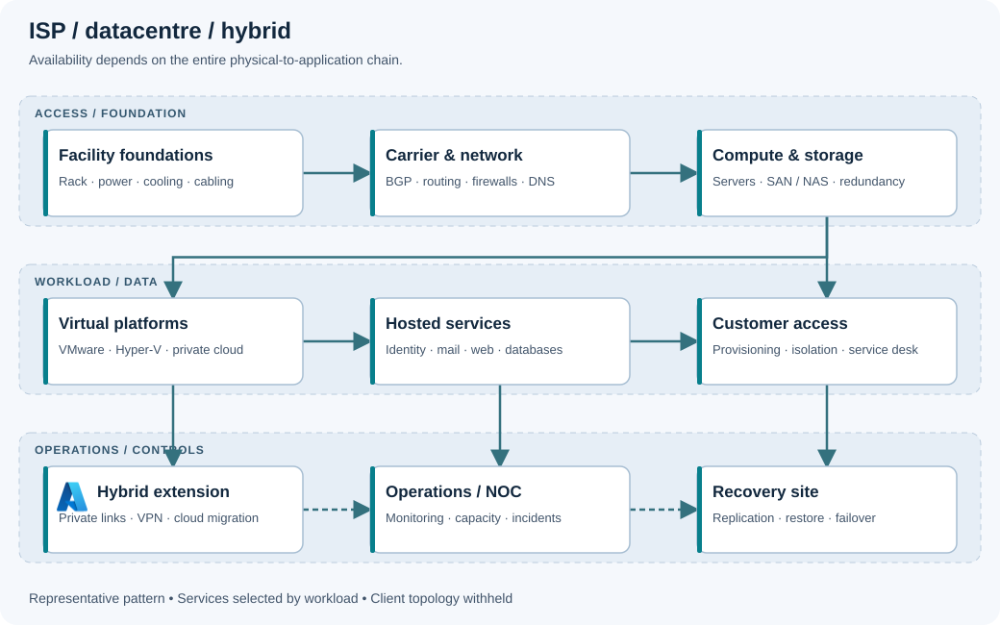

<strong>☁️ Microsoft / Azure · enterprise applications, data and governed AI</strong>

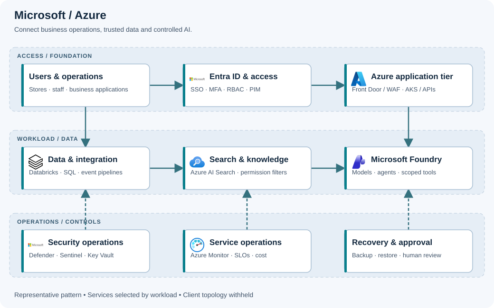

Identity, application services, governed data, retrieval, AI tools, monitoring and recovery belong to one controlled operating environment.

[Explore the Azure architecture](https://shahzadms7.github.io/#architecture-01)

<strong>☁️ AWS · tenant-aware applications and AI services</strong>

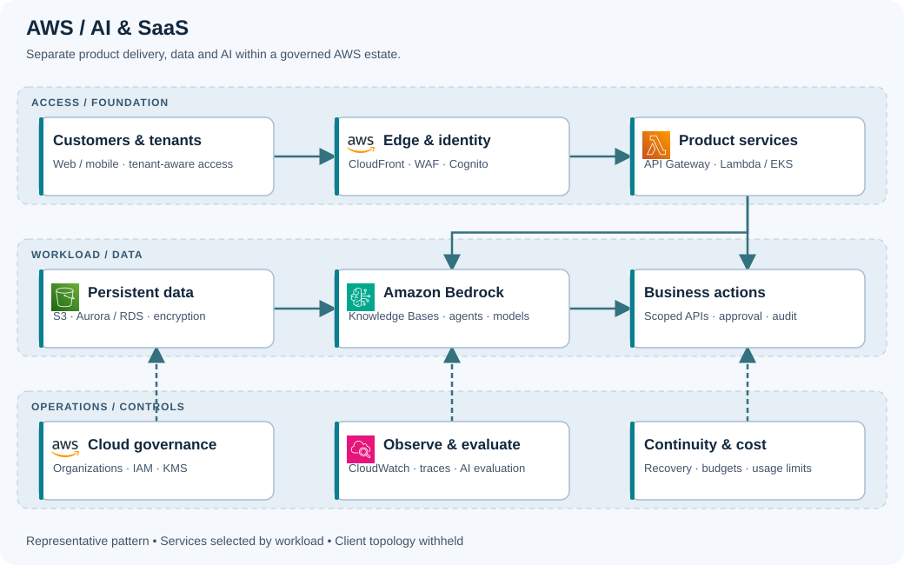

Product services, persistent data, model access, business actions and cloud governance have explicit responsibilities and boundaries.

[Explore the AWS architecture](https://shahzadms7.github.io/#architecture-02)

<strong>🛡️ Security · Zero Trust, privileged access and recovery</strong>

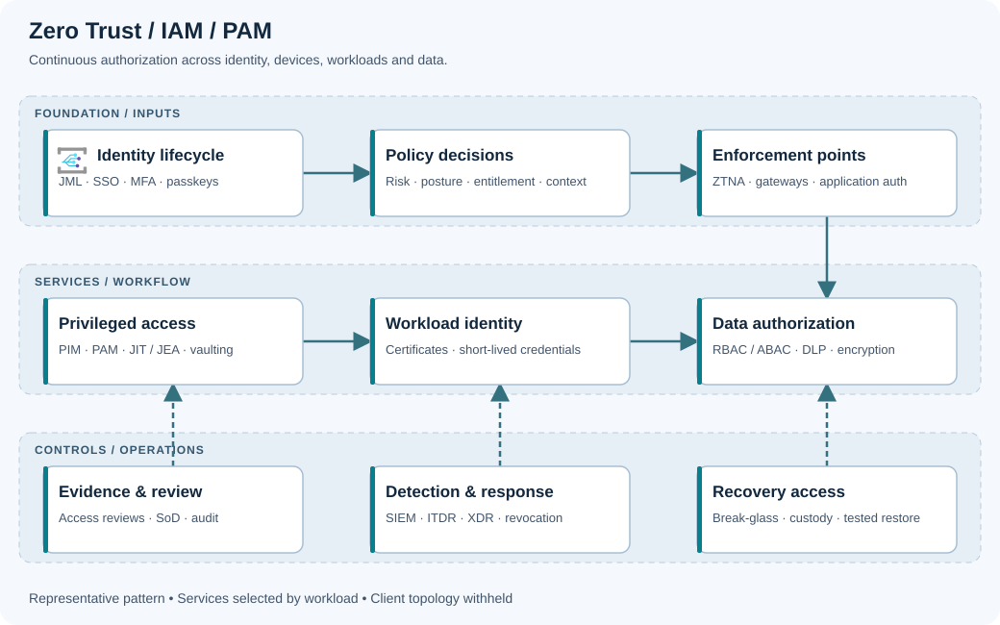

Identity lifecycle, contextual authorization, privileged access, workload credentials, data protection and recovery access work together.

[Security architecture](https://shahzadms7.github.io/#architecture-16) · [SOC operations](https://shahzadms7.github.io/#architecture-17) · [BCP and recovery](https://shahzadms7.github.io/#architecture-18)

<strong>📊 Data, analytics, ML and AI · bronze → silver → gold</strong>

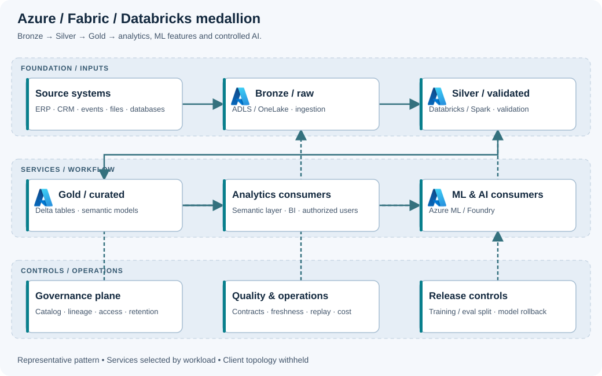

Raw, validated and curated data serve different purposes. Analytics, ML features and permission-aware AI consume governed data with quality, lineage and release controls.

[Azure](https://shahzadms7.github.io/#architecture-31) · [AWS](https://shahzadms7.github.io/#architecture-32) · [Google Cloud](https://shahzadms7.github.io/#architecture-33) · [Oracle](https://shahzadms7.github.io/#architecture-34) · [IBM](https://shahzadms7.github.io/#architecture-35)

<strong>🤖 Agent workflows · orchestration, MCP, approval and safe execution</strong>

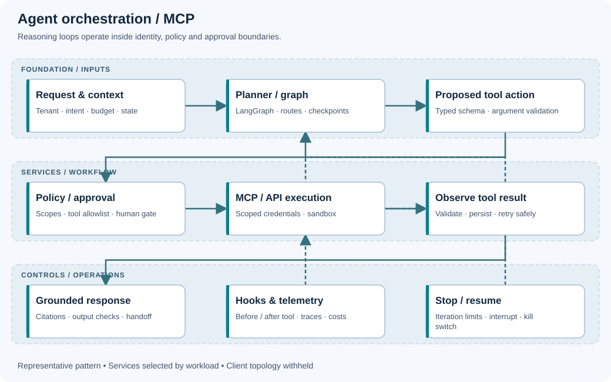

Planning, checkpoints, policy checks, tool execution, observation and stop/resume controls make the reasoning loop inspectable.

[Agent workflow](https://shahzadms7.github.io/#architecture-25) · [ML / LLM / agent operations](https://shahzadms7.github.io/#architecture-24)

**[Explore all 35 architecture views →](https://shahzadms7.github.io/#architecture)** 
Includes Cloudflare, Tailscale, Oracle, IBM, Alibaba reference options, bare metal, virtualization, Linux/UNIX, DevSecOps, platform engineering, SRE, databases, ERP, licensing, governance and multi-tier applications.

*Diagrams explain representative patterns. They are not confidential client as-built drawings or evidence that every pictured service was deployed together.*

## 🛠️ My technology and delivery breadth

 &nbsp;  &nbsp;  &nbsp;  &nbsp; <a href="https://shahzadms7.github.io/#product-icons">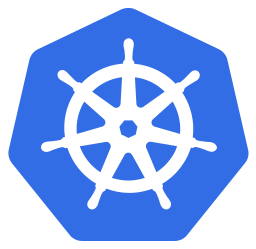</a> &nbsp;  &nbsp;  &nbsp; <a href="https://shahzadms7.github.io/#product-icons">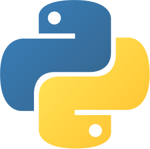</a> &nbsp;  &nbsp;  &nbsp; <a href="https://shahzadms7.github.io/#product-icons">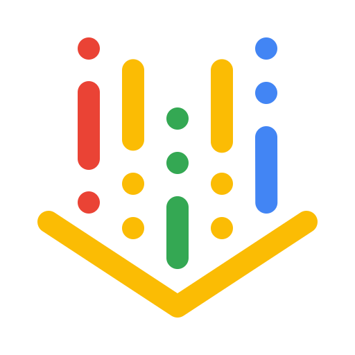</a> &nbsp; 

Selected platform and product marks; not certifications or endorsements. <a href="ICON_SOURCES.md">Artwork sources</a>.

| Domain | Platforms, responsibilities and solution areas |
|---|---|
| **Datacentres, ISP and bare metal** | Facilities and colocation, server provisioning, compute/storage fabrics, SAN/NAS, carrier connectivity, hosting, capacity, lifecycle and recovery sites. |
| **Networking, edge and connectivity** | Routing, switching, BGP, DNS, DHCP, VPN, segmentation, load balancing, firewalls, private connectivity, Cloudflare and Tailscale. |
| **Virtualization and operating systems** | VMware, Hyper-V, Nutanix, KVM/OpenStack; Windows Server, RHEL, Ubuntu, Debian, SUSE and other resume-listed Linux families; AIX, Solaris, HP-UX and IBM i. |
| **Multi-cloud infrastructure and platforms** | Azure, AWS, Google Cloud, Oracle and IBM; landing zones, networking, compute, storage, containers, serverless, tenancy and hybrid integration. |
| **Microsoft productivity and identity** | Active Directory, Exchange, Microsoft 365, SharePoint, Teams, Entra ID, migration/coexistence, Intune, Purview and entitlement management. |
| **Security operations and access** | Zero Trust; IAM, PIM, PAM, DLP, GRC, SIEM, SOAR, EDR/XDR/MDR; Sentinel, Defender, CrowdStrike, Fortinet, Palo Alto and security-service operations. |
| **Resilience and continuity** | HA, failover, fault tolerance, multi-site/region design, RPO/RTO, BCP, immutable backup, clean recovery and failback; Veeam, Acronis and cloud-native recovery. |
| **DevSecOps and software delivery** | Terraform, Bicep, CloudFormation, Ansible; GitHub/GitLab/Azure DevOps, CI/CD, GitOps, supply-chain controls, testing and release governance. |
| **Platform engineering and SRE** | Kubernetes, AKS/EKS/GKE, Docker, service networking, internal platforms, SLIs/SLOs, OpenTelemetry, Prometheus/Grafana, incident command and capacity engineering. |
| **Applications and integration** | Open-source SaaS, Python, Django, FastAPI, APIs, queues, events, authentication, tenant isolation, ERP/CRM integration and multi-tier application design. |
| **Enterprise business platforms** | Zoho, Odoo, Dynamics and Oracle integration; process discovery, finance/CRM/HR/inventory workflows, permissions, reconciliation and adoption. |
| **Databases, data engineering and analytics** | SQL Server, PostgreSQL, Oracle and other database platforms; integration, replication, warehousing, lakehouse/medallion patterns, Databricks, Fabric, BI and data governance. |
| **AI, ML and agents** | Foundry, Bedrock and Google AI platforms; RAG/GraphRAG, vector search, LangChain/LangGraph, MCP, agent loops, evaluation, guardrails and ML/LLM operations. |
| **Governance and commercial ownership** | Enterprise architecture, ITSM, risk and control mapping, NIST/ISO/OWASP-related practices, licensing/SAM, FinOps, procurement, vendor management and executive reporting. |
| **Customer and people leadership** | Discovery, presales, demonstrations, proposals, SOW/SOP, programme delivery, workshops, team leadership, mentoring, partner enablement and handover. |

[Full searchable technology catalog](https://shahzadms7.github.io/#catalog) · [Licensing responsibilities](https://shahzadms7.github.io/#licensing) · [IaaS / PaaS / SaaS delivery](https://shahzadms7.github.io/#service-models)

**Additional solution exploration:** SAP, Alibaba Cloud, SonicWall, small-language-model operations, mobile-specific patterns and other requested extensions are retained in a [separate reference section](https://shahzadms7.github.io/#solution-extensions) wherever engagement evidence is not established. Historical products, evaluations and production work remain distinguishable.

## 🌍 The industries behind the technology

My work spans different operating pressures: customer-facing availability, regulated information, distributed locations, critical infrastructure, service-provider obligations and startup economics.

| Business environment | Problems the portfolio addresses |
|---|---|
| Banking, financial services and insurance | Identity, information protection, integration, resilience and governed change. |
| Government, defence and critical infrastructure | Access boundaries, controlled operations, continuity and assurance. |
| Healthcare and distributed care | Secure information access, connected locations and dependable supporting services. |
| Manufacturing and industrial operations | Infrastructure, ERP integration, operational connectivity and continuity. |
| Retail, ecommerce and supply chain | Distributed systems, business applications, product data, analytics and controlled AI. |
| Legal, immigration, tax and professional services | Identity, messaging, collaboration, document workflows and recovery. |
| ISP, MSP, CSP and MSSP | Tenant isolation, service delivery, hosting, operations, security and customer reporting. |
| Software, media, travel, recruitment, education and nonprofit | Application delivery, workflow automation, collaboration and sustainable operations. |

[Explore the twelve industry groups →](https://shahzadms7.github.io/#industry-solutions)

## 📚 41 project families · one career

These families organize related work across engagements. They show the breadth behind my roles without presenting unrelated technologies as one implementation.

**Evidence key:** T1 production · T2 architecture/design · T3 prototype/POC/pilot · T4 training/certification · T5 evaluated. A family may include several evidence levels; this does not assign production status to every technology in it.

<strong>Open the complete 41-family project index</strong>

| # | Project family | Source evidence levels |
|---|---|---|
| 1 | [Enterprise Agentic AI, RAG and Document Intelligence](https://shahzadms7.github.io/#project-1) | T1, T2, T3, T5 |
| 2 | [AI Inference Infrastructure, Model Serving and GPU Economics](https://shahzadms7.github.io/#project-2) | T2, T3, T5 |
| 3 | [MLOps, Model Lifecycle and Machine Learning Engineering](https://shahzadms7.github.io/#project-3) | T2, T3, T4, T5 |
| 4 | [AI Governance, Assurance and Adversarial Testing](https://shahzadms7.github.io/#project-4) | T1, T2, T5 |
| 5 | [Hybrid Cloud, Physical Datacentre, Colocation and BCDR](https://shahzadms7.github.io/#project-5) | T1, T2 |
| 6 | [Azure Cloud Foundation and Landing Zone Architecture](https://shahzadms7.github.io/#project-6) | T1, T2, T3 |
| 7 | [AWS Multi-Account Foundation and Well-Architected Delivery](https://shahzadms7.github.io/#project-7) | T1, T2 |
| 8 | [Google Cloud and Oracle Cloud Infrastructure Architecture](https://shahzadms7.github.io/#project-8) | T1, T2, T3 |
| 9 | [Kubernetes Platform Engineering and Cluster Lifecycle](https://shahzadms7.github.io/#project-9) | T1, T2, T3, T5 |
| 10 | [Internal Developer Platform, Paved Roads and Developer Experience](https://shahzadms7.github.io/#project-10) | T1, T2, T3, T5 |
| 11 | [CI/CD, GitOps and Progressive Delivery](https://shahzadms7.github.io/#project-11) | T1, T2 |
| 12 | [DevSecOps and Software Supply-Chain Security](https://shahzadms7.github.io/#project-12) | T1, T2 |
| 13 | [Site Reliability Engineering and Production Operations](https://shahzadms7.github.io/#project-13) | T1, T2 |
| 14 | [Observability, Telemetry Pipelines and AIOps](https://shahzadms7.github.io/#project-14) | T1, T2, T5 |
| 15 | [Performance Engineering and Capacity Planning](https://shahzadms7.github.io/#project-15) | T1, T2, T3 |
| 16 | [Zero Trust, Identity Governance and Privileged Access](https://shahzadms7.github.io/#project-16) | T1, T2, T5 |
| 17 | [Security Operations, Detection Engineering and Threat Hunting](https://shahzadms7.github.io/#project-17) | T1, T2 |
| 18 | [Cloud Security Posture, Workload and Data Protection](https://shahzadms7.github.io/#project-18) | T1, T2, T5 |
| 19 | [Cyber Resilience, Ransomware Recovery and Continuity](https://shahzadms7.github.io/#project-19) | T1, T2 |
| 20 | [Post-Quantum Readiness and Cryptographic Modernisation](https://shahzadms7.github.io/#project-20) | T2, T5 |
| 21 | [Enterprise Storage Architecture and Data Protection](https://shahzadms7.github.io/#project-21) | T1, T2 |
| 22 | [Enterprise Networking, Private Connectivity and Carrier Operations](https://shahzadms7.github.io/#project-22) | T1, T2, T3 |
| 23 | [Windows, Linux and UNIX Estate Engineering](https://shahzadms7.github.io/#project-23) | T1, T2 |
| 24 | [Virtualisation, Hyperconverged and Private Cloud](https://shahzadms7.github.io/#project-24) | T1, T2 |
| 25 | [Microsoft 365 Migration, Licensing and Tenant Administration](https://shahzadms7.github.io/#project-25) | T1, T2, T5 |
| 26 | [Google Workspace Administration and Coexistence](https://shahzadms7.github.io/#project-26) | T1, T2 |
| 27 | [Endpoint, Device Management and Virtual Desktop](https://shahzadms7.github.io/#project-27) | T1, T2 |
| 28 | [Lakehouse, Data Platform and Streaming Architecture](https://shahzadms7.github.io/#project-28) | T1, T2, T3, T5 |
| 29 | [Data Governance, Quality and Master Data Management](https://shahzadms7.github.io/#project-29) | T2, T3, T5 |
| 30 | [Database Engineering and Distributed Data](https://shahzadms7.github.io/#project-30) | T1, T2 |
| 31 | [Analytics, Business Intelligence and Semantic Layer](https://shahzadms7.github.io/#project-31) | T2, T3 |
| 32 | [Software Architecture, Domain-Driven Design and Modernisation](https://shahzadms7.github.io/#project-32) | T1, T2, T3 |
| 33 | [Enterprise Integration, iPaaS and API Management](https://shahzadms7.github.io/#project-33) | T1, T2, T5 |
| 34 | [SaaS Product Engineering, Payments and Multi-Tenancy](https://shahzadms7.github.io/#project-34) | T1, T2, T3 |
| 35 | [Automation, Robotic Process Automation and Workflow Engineering](https://shahzadms7.github.io/#project-35) | T1, T2, T3, T5 |
| 36 | [IT Service Management, CMDB and Operational Governance](https://shahzadms7.github.io/#project-36) | T1, T2, T5 |
| 37 | [FinOps, Cloud Economics and Sustainable Technology](https://shahzadms7.github.io/#project-37) | T1, T2, T5 |
| 38 | [Regulated Delivery, Compliance Automation and Sovereignty](https://shahzadms7.github.io/#project-38) | T1, T2, T5 |
| 39 | [Enterprise Architecture Governance and Portfolio Management](https://shahzadms7.github.io/#project-39) | T1, T2 |
| 40 | [Forward-Deployed Engineering, Executive Advisory and Commercial Delivery](https://shahzadms7.github.io/#project-40) | T1, T2 |
| 41 | [Edge, Internet of Things, Operational Technology and Physical AI](https://shahzadms7.github.io/#project-41) | T1, T2, T3, T5 |

**[Read the complete career record →](https://shahzadms7.github.io/#career-library)** 
All 725 non-empty source records are accounted for in the reviewed resume archive. Detailed responsibilities, technology terms and learning records remain accessible beyond this introduction.

## 🎓 Education, credentials and continuous learning

Learning has continued throughout my career—from foundational systems and enterprise platforms to cloud, cybersecurity, data and AI.

The following record reproduces resume-listed education, credentials and training. Training attendance, exam identifiers, pending examinations and earned certifications are different categories; current credential validity requires the relevant verification record.

<strong>Education</strong>

Master of Science, Information Systems Security and Information Assurance, University of the People

Bachelor of Science, Computer Science, University of the People

Postgraduate Diploma and Diploma, Software Engineering, Abaseen Institute and AIMMS, Trade Testing Board KPK

<strong>Microsoft</strong>

AZ-305 Azure Solutions Architect Expert; AZ-104 Azure Administrator Associate; SC-200 Security Operations Analyst; SC-300 Identity and Access Administrator; SC-400 Information Protection Administrator; Microsoft 365 Enterprise Administrator Expert; AI-900; AZ-900; MS-900; SC-900; MCSE Cloud Platform and Infrastructure, charter member; MCSA Windows Server 2012; Microsoft Certified Professional; Entra ID fundamentals; Windows 10 administration; Microsoft 365 Teams and messaging administration.

<strong>AWS</strong>

Solutions Architect Professional; DevOps Engineer Professional; Solutions Architect Associate; Developer Associate; Security Specialty; Advanced Networking Specialty; Database Specialty; SysOps Administrator Associate; Cloud Practitioner; AWS Concepts; AWS Security Fundamentals.

<strong>Google Cloud, security and governance</strong>

Google Cloud Digital Leader; Professional Cloud Architect, examination-ready; Google Cloud Platform Fundamentals; ISO/IEC 27001 Lead Implementer; CompTIA Security+, Network+, Linux+, Cloud+ and A+; ITIL 4; ISC2 Certified in Cybersecurity; Certified Ethical Hacker; CyberArk Defender; Fortinet NSE 2; CISM; CISA; CCSP; CySA+.

<strong>Virtualization, Red Hat and analytics</strong>

VMware Certified Professional Data Center Virtualization 6.5, 6.0 and 5.5; VMware vSphere Install, Configure and Manage; Red Hat EX200 and EX294; Google Ads Search, Display, Video, Apps and Shopping; Display and Video 360; Search Ads 360; Campaign Manager; Creative; Google Analytics Individual Qualification.

<strong>AI learning and events</strong>

Anthropic Academy twenty-two-course catalogue: Claude Platform 101; Building with the Claude API; Claude Code 101; Claude Code in Action; Introduction to Model Context Protocol; Model Context Protocol Advanced Topics; Introduction to Agent Skills; Introduction to Subagents; Claude in Amazon Bedrock; Claude with Vertex AI; Claude 101; Introduction to Claude Cowork; AI Capabilities and Limitations; AI Fluency Framework and Foundations for Builders, Educators, Students, Nonprofits, Small Businesses and K-12 educators. Oracle Agentic AI Foundations Associate 1Z0-1157-26. Microsoft AI Skills Fest. Microsoft Innovation Challenge Hackathon. Women in Cloud AI Innovation Challenge.

<strong>Recognition and development roadmap</strong>

First place, Microsoft AI Innovation Hackathon 2025. SC-100 and CISSP preparation complete; examinations pending. Microsoft and Google Cloud architect track targeted December 2026. Google Professional Machine Learning Engineer targeted Q1 2027. The resume’s Q1 2027 AWS Machine Learning Specialty exam target is retained as a historical plan requiring revision: that exam retired March 31, 2026. GenAI Fundamentals, LLM Foundations and Agent Development certifications in progress. CKA, CKS, HashiCorp Terraform Associate, FinOps Certified Practitioner, AZ-400 and OCI Architect under evaluation.

<strong>Foundational and vendor training</strong>

Rackspace CloudU; NEC Express Cluster; Linux introduction and advanced administration; Oracle 9i Database Administrator OCP track; BrainBench HTML, web and electronic-commerce concepts; Certified Internet Webmaster and NHIPP; hypertext, scripting and client-side programming; personal-computer maintenance; office productivity and computer-aided design training; foundational operating-system training; higher-secondary pre-engineering.

[Explore professional development](https://shahzadms7.github.io/#credentials) · [Dated product and exam lifecycle notes](https://shahzadms7.github.io/#current-reference)

## 🤝 Let’s work together

**For an employer:** architecture leadership that can move from stakeholder discussions into implementation and operational delivery. 
**For a business owner:** a technical partner who can turn a business problem into an agreed scope, working service and supportable handover. 
**For a startup:** founder-minded architecture, product engineering and fractional technology leadership. 
**For a delivery partner:** customer-facing discovery, presales, engineering capacity, complex escalation and knowledge transfer.

Tell me **the business problem, desired outcome, timing and engagement type**. We can establish the scope and determine where I can contribute most effectively.

### [✉️ Email Shahzad](mailto:shahzad.ms@yahoo.com) · [LinkedIn](https://www.linkedin.com/in/shahzadms/) · [Full portfolio](https://shahzadms7.github.io/)

---

<strong>Confidentiality, evidence and portfolio scope</strong>

Client identities and confidential topology are withheld. Public descriptions generalize sensitive details; private walkthroughs remain subject to permitted disclosure. Resume-listed claims are owner-supplied, not independent verification. Architecture patterns and researched options do not create new personal experience.

The source review covers the available resume, not every technology ever released or every undocumented career event. Remaining items requiring clarification are tracked openly in the [coverage review](COVERAGE_REVIEW.md) and [source register](coverage-audit.json). The [official-source research](research-data.json) is dated 1 September 2026.

This repository hosts my personal portfolio. It is not a claim of affiliation with, endorsement by, or certification from the vendors whose products are discussed.

